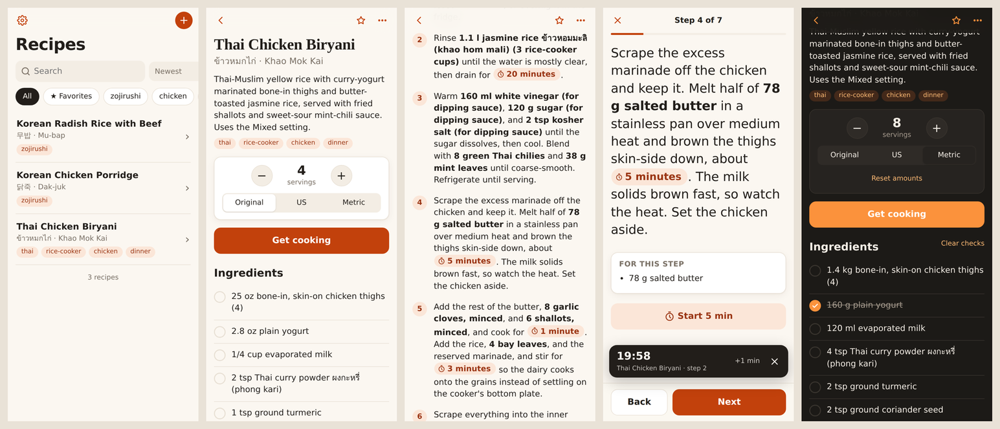

# Recipe Box

A home-screen app for keeping the recipe cards Claude makes, and cooking from them.



Claude shows recipes as interactive cards, but they live inside a chat. Recipe Box gives them a
permanent home. Copy a card, paste it in, and it keeps the same interactivity:

- **Servings scaling** that also rescales the amounts written inside the steps
- **Original / US / Metric** units
- **Get cooking**: one step at a time, big text, swipe between steps, screen stays on
- **Tap-to-start timers** on every time mentioned in a step

Plus what a chat can't do:

- a searchable **library** (including non-Latin names like ข้าวหมกไก่ or 닭죽, and ingredients)
- **tags**, **favorites** and **ingredient check-offs**
- a **cook log** (date, rating, what you changed, how it came out) for tuning a recipe over time

It's a static site on GitHub Pages with no build step, no dependencies and no server. Your
recipes are plain JSON files in your own repo, so they're versioned, portable, and never locked
into an app.

## Make your own

1. **Fork this repo** (or copy it). Then clear out my recipes:
   ```sh
   rm -rf recipes/*/ && node scripts/recipes.mjs reindex
   ```
   The app works with an empty library.
2. **Turn on GitHub Pages:** Settings → Pages → *Deploy from a branch* → `main` → `/ (root)`.
   A minute later the app is at `https://<you>.github.io/<repo>/`.
3. **Create a token so the app can save:**
   [github.com/settings/personal-access-tokens/new](https://github.com/settings/personal-access-tokens/new)
   - Repository access: *Only select repositories* → your fork
   - Repository permissions → **Contents: Read and write** (nothing else)
4. **On your iPhone:** open the Pages URL in Safari → Share → **Add to Home Screen**. Open the
   app from the home screen → ⚙︎ Settings → paste the token → **Test connection**.

Home-screen apps have their own storage, separate from Safari, so enter the token inside the
home-screen app.

## Adding a recipe

1. In Claude, open the recipe card and **switch it to Metric**. Grams are the card's real
   amounts; its ounce amounts are rounded conversions.
2. Copy the recipe text.
3. In Recipe Box tap **+** → **Paste**, set servings (the card text doesn't include them) and
   tags → **Save recipe**.

A PDF printed from the card also works, since it has the same text, but plain text is cleaner.

## Timers

Tap any time in a step (for example **20 minutes**). Timers run in the app and chime while it's
open, and in cooking mode the screen stays on.

iOS pauses web apps in the background. For timers that ring with the app closed, switch
Settings → Timers → **iOS Clock** and create a shortcut named `Recipe Timer` in the Shortcuts
app: *Receive Text input → Get Numbers from Shortcut Input → Start Timer for (Numbers) seconds*.

## How recipes are stored

```
recipes/
  index.json                 one summary per recipe (what the library loads)
  <id>/recipe.json           the parsed recipe, tags, servings, favorite, cook log
  <id>/source.txt            the card text exactly as pasted, never edited
```

Every save is one commit covering all the files it touches. If another device saved in
between, the app rebuilds on top of that commit instead of overwriting it. Reads use the GitHub
API when a token is set, and the Pages copy otherwise. Both are cached for offline use.
Per-device state (checked ingredients, chosen servings and units, running timers) stays on the
device.

## Security and privacy

- **Your recipes are public.** Free GitHub Pages needs a public repo, so anyone can read
  `recipes/`. Only token holders can change them.
- **The token stays on your device.** It's kept in the home-screen app's local storage and sent
  only to `api.github.com`. Use a fine-grained token limited to this one repo with only
  *Contents: Read and write*. Then the worst a leaked token can do is edit this repo, and you
  can revoke it on GitHub at any time.
- **Other pages on the same domain can read that storage.** Everything on
  `<you>.github.io` is one website to the browser, so any other Pages site you publish there
  could read the token. Don't host untrusted code on the same account's Pages, or use a
  custom domain for this app.
- **Hardening in the app:**
  - a Content-Security-Policy that allows scripts only from this site and network calls only
    to this site and the GitHub API
  - all recipe text rendered as plain text, never as HTML
  - only `http(s)` links accepted for the chat link
  - recipe ids validated before they become file paths
  - the app refuses to run inside another site's frame
- **Found a problem?** Please open an issue, or use GitHub's private vulnerability reporting
  if it's sensitive.

## From a computer

```sh
node scripts/recipes.mjs add card.txt --servings 4 --tags thai,dinner   # add a recipe
node scripts/recipes.mjs reindex                                        # rebuild recipes/index.json
npm test                                                                 # parser, units, security tests
python3 -m http.server                                                   # run locally on :8000
```

## Code

`index.html`, `styles.css`, and ES modules in `js/`:

| File | What it does |
| --- | --- |
| `parser.js` | Turns Claude recipe card text into a recipe: title parts, ingredients, steps, notes. Links each step to the ingredients it mentions and finds timers. |
| `units.js` | Quantities, scaling, fractions, US/metric conversion. |
| `store.js` | Reads and writes recipe files through the GitHub API, plus the offline cache. |
| `timers.js` | Kitchen timers, chime, screen wake lock. |
| `app.js` | The screens: library, recipe card, cooking mode, import/edit, cook log, settings. |
| `sw.js` | Service worker for offline use. |

## License

[MIT](LICENSE)
